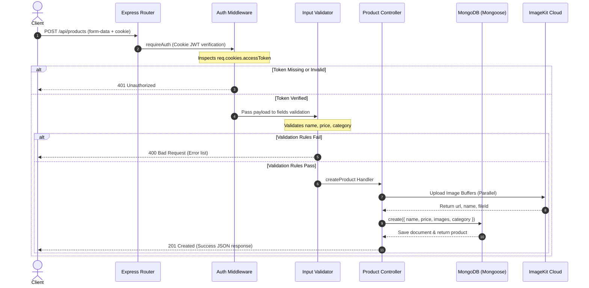

# 📦 E-Commerce Product API

[](https://www.typescriptlang.org/)
[](https://nodejs.org/)
[](https://expressjs.com/)
[](https://www.mongodb.com/)
[](https://imagekit.io/)
[](https://pnpm.io/)

A highly structured, secure, and production-ready **E-Commerce Product Management API** built with **Node.js**, **Express**, **TypeScript**, and **MongoDB**. It serves as a secure backend for inventory and product management, featuring cloud-based parallel file uploads, strict input validation schemas, and bulletproof user authentication using stateful JWT cookies.

---

## 🌟 Key Features

- **🔐 Stateless JWT Authentication**: Employs secure, `httpOnly`, `secure`, and `sameSite: strict` cookie-based JWT authorization to prevent XSS and reduce CSRF vulnerabilities.
- **☁️ Cloud-Native Image Processing**: Integrates seamlessly with **ImageKit** for streaming files in memory using **Multer**. Supports uploading up to 5 images per product concurrently, with automatic storage cleanups upon product deletion.
- **🛡️ Rigid Input Validation**: Validates user inputs and product schemas strictly using `express-validator` to guarantee data integrity before hitting database controllers.
- **🧩 Enterprise-Grade Error Handling**: Includes a unified error middleware and a custom `ApiError` utility wrapped with an asynchronous controller error-catcher.
- **⚡ Built with TypeScript**: Offers strong typing, compile-time checks, and robust code modularization.

---

## 🏗️ System Architecture

The application adopts a decoupled **Layered Controller-Service-Repository** pattern. By separating request routing, input validation, authentication gating, business workflow, and model management, the application guarantees high testability and maintainability.



### Architectural Pillars:
1. **Routing Layer**: Located in `src/routes/`, maps resources to HTTP verbs, running validation and upload middlewares sequentially.
2. **Middleware & Gates**: Secure routes and extract validated parameters. The authentication gate injects the authenticated user ID (`req.user`) into a custom `AuthenticatedRequest` extension.
3. **Controller Layer**: Decoupled handlers located in `src/controllers/` orchestrating service components. Uses an asynchronous utility wrapper (`asyncHandler`) to catch errors without writing nested `try-catch` blocks.
4. **Data Access (Models)**: Handled by Mongoose schemas inside `src/models/` implementing model-level methods (e.g., `matchedPassword` hook for bcrypt-encoded strings) and model schemas with strict enum constraints (e.g., `ProductCategory` constraint).

---

## 📂 Folder Structure

```text
product-api/
├── src/
│   ├── config/             # Environment configurations, databases & client integrations
│   │   ├── config.ts       # Central environment variables loader & validation
│   │   ├── database.ts     # MongoDB connection setup via Mongoose
│   │   ├── imageKit.ts     # ImageKit Node.js SDK client instantiation
│   │   └── multer.ts       # Multer configuration utilizing memory storage
│   ├── controllers/        # Business logic handlers (Processes inputs, interacts with models)
│   │   ├── product.controller.ts # Product CRUD operations & ImageKit integration logic
│   │   └── user.controller.ts    # User signup and secure cookie session login logic
│   ├── middlewares/        # Custom Express request interception hooks
│   │   ├── auth.middleware.ts     # Validates JWT in cookie and populates req.user
│   │   ├── error.middleware.ts    # Centralized global error response renderer
│   │   └── validate.middleware.ts # Extracts and returns validation errors from requests
│   ├── models/             # Schema structures & TypeScript interface blueprints
│   │   ├── product.model.ts  # Product document schema & ProductCategory enum definitions
│   │   └── user.model.ts     # User schema, password-hashing pre-save hook, instance methods
│   ├── routes/             # Path routing registries
│   │   ├── product.route.ts  # Mounts product management endpoints
│   │   └── user.route.ts     # Mounts registration & authentication endpoints
│   ├── type/               # Custom declarations and interfaces
│   │   └── index.ts        # Extends default Express Request interface with req.user property
│   ├── utils/              # Helper utilities and operational handlers
│   │   ├── apiError.ts       # Specialized ApiError operational class extending native Error
│   │   ├── asyncHandler.ts   # Wraps async middleware to forward errors to central boundary
│   │   └── generateToken.ts  # Generates signed JWTs for session cookies
│   ├── app.ts              # Configures Express core modules & registers basic middleware
│   └── server.ts           # Bootstraps database connection and starts network listeners
├── .env                    # Environment credentials and configurations (Local-only)
├── .gitignore              # Files/folders to exclude from git control
├── package.json            # Scripts, dependency details, and package definitions
├── pnpm-lock.yaml          # Pnpm lockfile ensuring predictable builds
└── tsconfig.json           # Compiler rules for TypeScript compilation
```

---

## 🔌 API Reference

### User Authentication Endpoints
All auth endpoints are public, mount under `/api/auth`, and set an `accessToken` in secure HTTP-only cookies on success.

| HTTP Method | API Endpoint | Description | Auth Required? | Key Middlewares Applied |
| :--- | :--- | :--- | :---: | :--- |
| **`POST`** | `/api/auth/register` | Registers a new user, hashes password, saves record, and issues authentication cookie. | ❌ No | `userRegisterInputRules`, `validate` |
| **`POST`** | `/api/auth/login` | Validates credentials, signs a JWT session token, and establishes a secure cookie session. | ❌ No | `userLoginInputRules`, `validate` |

### Product Management Endpoints
Product routes mount under `/api/products` and support standard CRUD operations.

| HTTP Method | API Endpoint | Description | Auth Required? | Key Middlewares Applied |
| :--- | :--- | :--- | :---: | :--- |
| **`GET`** | `/api/products` | Fetches products list. Supports filtering dynamically by passing `?category=yourCategory`. | ❌ No | *None* |
| **`GET`** | `/api/products/:id` | Returns details of a specific product using its unique MongoDB ObjectId. | ❌ No | *None* |
| **`POST`** | `/api/products` | Creates a product. Handles up to 5 image uploads, saves buffers to ImageKit, and registers product. | 🔐 Yes | `upload.array("images", 5)`, `requireAuth`, `productFieldRules`, `validate` |
| **`PATCH`** | `/api/products/:id` | Partially updates fields on an existing product (such as name, description, price, or category). | 🔐 Yes | `requireAuth`, `productUpdateRules`, `validate` |
| **`DELETE`** | `/api/products/:id` | Deletes a product, executing a cleanup to delete all associated images in ImageKit in parallel first. | 🔐 Yes | `requireAuth` |

---

## ⚙️ Local Setup Guide

Follow these steps to run the E-Commerce Product API locally on your system.

### 📋 Prerequisites
- **Node.js** (v18.0.0 or higher)
- **pnpm** (v10.0.0 or higher)
- **MongoDB** (A local community server instance or a cloud database like MongoDB Atlas)
- **ImageKit Account** (Free tier account to obtain credentials for image management)

### 🚀 Setup Steps

1. **Navigate to the Project Root**
   ```bash
   cd product-api
   ```

2. **Install Dependencies**
   Install all dev and production packages securely using `pnpm`:
   ```bash
   pnpm install
   ```

3. **Configure Environment Variables**
   Create a `.env` file in the project's root folder:
   ```bash
   touch .env
   ```
   Add and populate the following keys inside your `.env` file:
   ```env
   # Network Port
   PORT=8080

   # MongoDB Connection String
   MONGODB_URI=mongodb://localhost:27017/product_db

   # Secure JWT Secret Key (Any random secure string)
   JWT_SECRET=super_secret_jwt_generation_key_123!

   # ImageKit Private Key (Retrieved from ImageKit Console -> Developer Options)
   IMAGEKIT_PRIVATE_KEY=private_yourPrivateKeyStringFromImageKit=
   ```

4. **Start the Application**
   - **Development Mode** (With hot-reloading using `tsx watch`):
     ```bash
     pnpm dev
     ```
   - **TypeScript Transpilation** (Verify code compiles cleanly):
     ```bash
     pnpm tsc
     ```

Once the dev command is executed, you should see the following logs confirming successful setups:
```text
connected to MongoDB ✅
Server running on port: 8080
```

---

## 🛡️ Security & Validations

### 1. Cookies & JWT Rules
- Tokens are assigned under the key name `accessToken` during registration and login.
- Cookies use advanced options for security:
  ```typescript
  res.cookie("accessToken", accessToken, {
    httpOnly: true, // Prevents client-side scripts (XSS) from reading the cookie
    secure: true,   // Ensures cookie is only transmitted over HTTPS
    sameSite: "strict", // Shield against Cross-Site Request Forgery (CSRF)
  });
  ```

### 2. Supported Categories
Products are validated against the following categories during creation/updates:
- `electronics`, `accessories`, `clothing`, `footwear`, `home_and_kitchen`, `sports`, `books`, `other`

### 3. File Limitations
- Route: `POST /api/products` accepts files via the form-data key name `images`.
- Limit: Up to **5 files** per request are parsed and dispatched to ImageKit storage.
